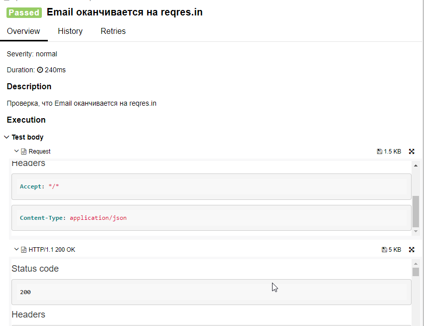

# Проект по автоматизации тестирования API на сайте reqres.in
<p align="center">
<a href="https://reqres.in/"></a>
</p>

Документация для сайта reqres.in выложена на главной странице и доступна всем пользователям.
<p align="center">
<a href="https://reqres.in/"></a>
</p>

## :memo: Содержание:

- [Технологии](#classical_building-Технологии)
- [Сборка в Jenkins](#man_cook-Jenkins-job)
- [Allure отчет](#bar_chart-Allure-отчет)

## :boom: Технологии
<p align="center">


</p>


- В данном проекте автотесты написаны на **Java** с использованием  **RestAssured**.
- Для сборки проекта используется **Gradle**.
- **JUnit 5** используется как фреймворк для модульного тестирования.
- Запуск тестов выполняется из **Jenkins**.
- **Allure Report** для визуализации результатов тестирования.


## :man_cook: Jenkins job
</a>  <a target="_blank" href="https://jenkins.autotests.cloud/job/011-LMaslo-api-diplom/">Jenkins job</a>
<p align="center">
<a href="https://jenkins.autotests.cloud/job/011-LMaslo-api-diplom/"></a>
</p>


###  Локальный запуск:
```
gradle clean test
```

## :bar_chart: Allure-отчет
</a> Отчет в <a target="_blank" href="https://jenkins.autotests.cloud/job/011-LMaslo-api-diplom/4/allure/">Allure report</a>
<p align="center">
<a href="https://jenkins.autotests.cloud/job/011-LMaslo-api-diplom/4/allure/"></a>
  <a href="https://jenkins.autotests.cloud/job/011-LMaslo-api-diplom/4/allure/"></a>
</p>
